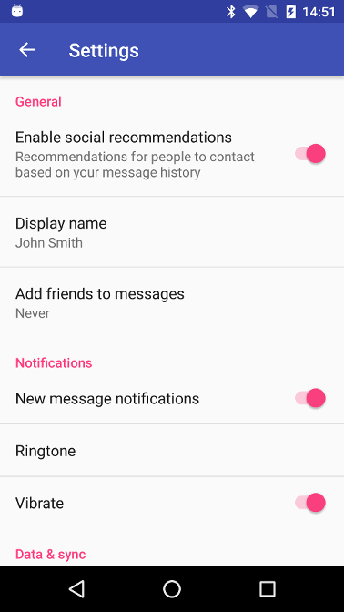

# Android Studio Templates

### Installation
* Copy the template folder you want into your [path to android studio]/plugins/android/lib/templates directory.  
* Restart Android Studio if it's running.

## Flat Settings Activity
Adapted from the standard Google Android Studio Settings activity but flattened, no headings for when you have a short list of settings.  
Categories are used to separate sections of settings.  
Both Java and Kotlin templates provided.

### Acknowledgements
Android Open Source Project for basis of some of these templates.

### Copyright
Copyright (c) 2018 CodeChimp
